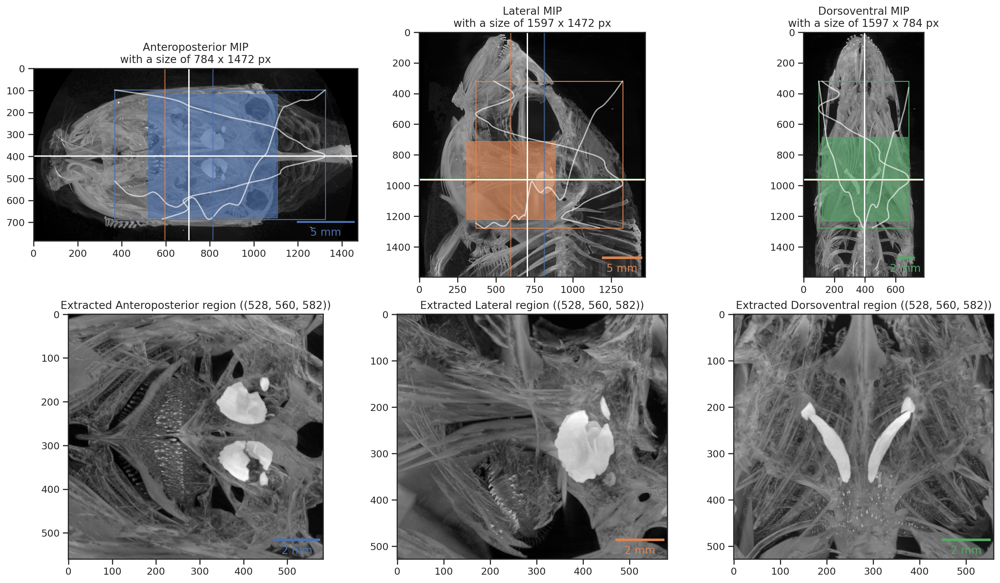

## Results {.page_break_before}

### Extraction of oral and pharyngeal jaws, visualization of tomographic data

[TODO]: # (Add small sampler of results of extraction. Let's show some images)

### Principal component analysis of skull landmarks

[TODO]: # (Show some results from Kassandras PCA)

### Automatic extraction of otoliths

{#fig:otolither}

[TODO]: # (Expand caption, so that it it self-sufficient.)
[TODO]: # (`whichone=55`)

{#fig:otolith3d}