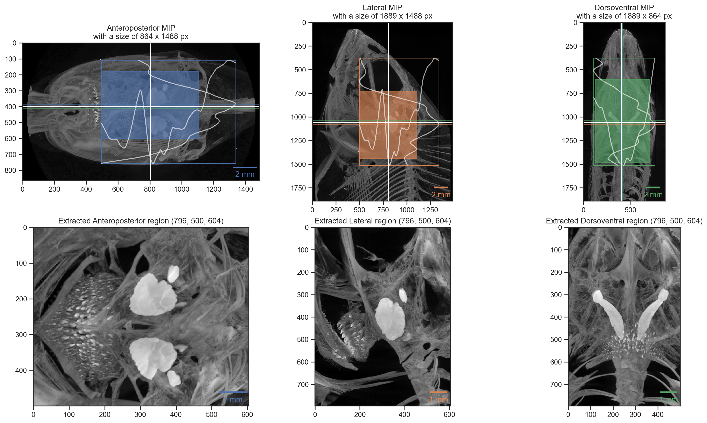

---
title: Microtomographic investigation of a large corpus of cichlids
keywords:
- cichlids
- fish morphology
- x-ray micro-tomography
lang: en-US
date-meta: '2023-02-01'
author-meta:
- David Haberthür
- Mikki Law
- Kassandra Ford
- Marcel Häsler
- Ole Seehausen
- Ruslan Hlushchuk
header-includes: |-
  <!--
  Manubot generated metadata rendered from header-includes-template.html.
  Suggest improvements at https://github.com/manubot/manubot/blob/main/manubot/process/header-includes-template.html
  -->
  <meta name="dc.format" content="text/html" />
  <meta name="dc.title" content="Microtomographic investigation of a large corpus of cichlids" />
  <meta name="citation_title" content="Microtomographic investigation of a large corpus of cichlids" />
  <meta property="og:title" content="Microtomographic investigation of a large corpus of cichlids" />
  <meta property="twitter:title" content="Microtomographic investigation of a large corpus of cichlids" />
  <meta name="dc.date" content="2023-02-01" />
  <meta name="citation_publication_date" content="2023-02-01" />
  <meta name="dc.language" content="en-US" />
  <meta name="citation_language" content="en-US" />
  <meta name="dc.relation.ispartof" content="Manubot" />
  <meta name="dc.publisher" content="Manubot" />
  <meta name="citation_journal_title" content="Manubot" />
  <meta name="citation_technical_report_institution" content="Manubot" />
  <meta name="citation_author" content="David Haberthür" />
  <meta name="citation_author_institution" content="Institute of Anatomy, University of Bern, Baltzerstrasse 2, CH-3012 Bern, Switzerland" />
  <meta name="citation_author_orcid" content="0000-0003-3388-9187" />
  <meta name="twitter:creator" content="@habi" />
  <meta name="citation_author" content="Mikki Law" />
  <meta name="citation_author_institution" content="Aquatic Ecology and Evolution, Institute of Ecology and Evolution, University of Bern, CH-3012 Bern, Switzerland" />
  <meta name="citation_author_institution" content="Department of Fish Ecology and Evolution, EAWAG, Swiss Federal Institute for Aquatic Science and Technology, CH-6047 Kastanienbaum, Switzerland" />
  <meta name="citation_author" content="Kassandra Ford" />
  <meta name="citation_author_institution" content="Department of Biological Sciences, George Washington University" />
  <meta name="citation_author_institution" content="EAWAG Aquatic Research Institute, Switzerland" />
  <meta name="citation_author_institution" content="Aquatic Ecology and Evolution, Institute of Ecology and Evolution, University of Bern, CH-3012 Bern, Switzerland" />
  <meta name="citation_author_orcid" content="0000-0002-4413-2633" />
  <meta name="twitter:creator" content="@kassthefish" />
  <meta name="citation_author" content="Marcel Häsler" />
  <meta name="citation_author_institution" content="Aquatic Ecology and Evolution, Institute of Ecology and Evolution, University of Bern, CH-3012 Bern, Switzerland" />
  <meta name="citation_author_institution" content="Department of Fish Ecology and Evolution, EAWAG, Swiss Federal Institute for Aquatic Science and Technology, CH-6047 Kastanienbaum, Switzerland" />
  <meta name="citation_author" content="Ole Seehausen" />
  <meta name="citation_author_institution" content="Aquatic Ecology and Evolution, Institute of Ecology and Evolution, University of Bern, CH-3012 Bern, Switzerland" />
  <meta name="citation_author_institution" content="Department of Fish Ecology and Evolution, EAWAG, Swiss Federal Institute for Aquatic Science and Technology, CH-6047 Kastanienbaum, Switzerland" />
  <meta name="citation_author_orcid" content="0000-0001-6598-1434" />
  <meta name="citation_author" content="Ruslan Hlushchuk" />
  <meta name="citation_author_institution" content="Institute of Anatomy, University of Bern, Baltzerstrasse 2, CH-3012 Bern, Switzerland" />
  <meta name="citation_author_orcid" content="0000-0002-6722-8996" />
  <link rel="canonical" href="https://habi.github.io/EAWAG-manuscript/" />
  <meta property="og:url" content="https://habi.github.io/EAWAG-manuscript/" />
  <meta property="twitter:url" content="https://habi.github.io/EAWAG-manuscript/" />
  <meta name="citation_fulltext_html_url" content="https://habi.github.io/EAWAG-manuscript/" />
  <meta name="citation_pdf_url" content="https://habi.github.io/EAWAG-manuscript/manuscript.pdf" />
  <link rel="alternate" type="application/pdf" href="https://habi.github.io/EAWAG-manuscript/manuscript.pdf" />
  <link rel="alternate" type="text/html" href="https://habi.github.io/EAWAG-manuscript/v/87f52b0a2d63d2dc242908ba87e333f3280d2a87/" />
  <meta name="manubot_html_url_versioned" content="https://habi.github.io/EAWAG-manuscript/v/87f52b0a2d63d2dc242908ba87e333f3280d2a87/" />
  <meta name="manubot_pdf_url_versioned" content="https://habi.github.io/EAWAG-manuscript/v/87f52b0a2d63d2dc242908ba87e333f3280d2a87/manuscript.pdf" />
  <meta property="og:type" content="article" />
  <meta property="twitter:card" content="summary_large_image" />
  <link rel="icon" type="image/png" sizes="192x192" href="https://manubot.org/favicon-192x192.png" />
  <link rel="mask-icon" href="https://manubot.org/safari-pinned-tab.svg" color="#ad1457" />
  <meta name="theme-color" content="#ad1457" />
  <!-- end Manubot generated metadata -->
bibliography:
- content/manual-references.bib
manubot-output-bibliography: output/references.json
manubot-output-citekeys: output/citations.tsv
manubot-requests-cache-path: ci/cache/requests-cache
manubot-clear-requests-cache: false
...

<small><em>
This manuscript
([permalink](https://habi.github.io/EAWAG-manuscript/v/87f52b0a2d63d2dc242908ba87e333f3280d2a87/))
was automatically generated
from [habi/EAWAG-manuscript@87f52b0](https://github.com/habi/EAWAG-manuscript/tree/87f52b0a2d63d2dc242908ba87e333f3280d2a87)
on February 1, 2023.
</em></small>

## Authors

+ **David Haberthür** 
    {.inline_icon width=16 height=16}
    [0000-0003-3388-9187](https://orcid.org/0000-0003-3388-9187)
    · {.inline_icon width=16 height=16}
    [habi](https://github.com/habi)
    · {.inline_icon width=16 height=16}
    [habi](https://twitter.com/habi) 
  <small>
     Institute of Anatomy, University of Bern, Baltzerstrasse 2, CH-3012 Bern, Switzerland
  </small>

+ **Mikki Law** 
    · {.inline_icon width=16 height=16}
    [mlaw-migalig](https://github.com/mlaw-migalig) 
  <small>
     Aquatic Ecology and Evolution, Institute of Ecology and Evolution, University of Bern, CH-3012 Bern, Switzerland; Department of Fish Ecology and Evolution, EAWAG, Swiss Federal Institute for Aquatic Science and Technology, CH-6047 Kastanienbaum, Switzerland
  </small>

+ **Kassandra Ford** 
    {.inline_icon width=16 height=16}
    [0000-0002-4413-2633](https://orcid.org/0000-0002-4413-2633)
    · {.inline_icon width=16 height=16}
    [kassthefish](https://github.com/kassthefish)
    · {.inline_icon width=16 height=16}
    [kassthefish](https://twitter.com/kassthefish) 
  <small>
     Department of Biological Sciences, George Washington University; EAWAG Aquatic Research Institute, Switzerland; Aquatic Ecology and Evolution, Institute of Ecology and Evolution, University of Bern, CH-3012 Bern, Switzerland
  </small>

+ **Marcel Häsler** 
    · {.inline_icon width=16 height=16}
    [mphaesler](https://github.com/mphaesler) 
  <small>
     Aquatic Ecology and Evolution, Institute of Ecology and Evolution, University of Bern, CH-3012 Bern, Switzerland; Department of Fish Ecology and Evolution, EAWAG, Swiss Federal Institute for Aquatic Science and Technology, CH-6047 Kastanienbaum, Switzerland
  </small>

+ **Ole Seehausen** 
    {.inline_icon width=16 height=16}
    [0000-0001-6598-1434](https://orcid.org/0000-0001-6598-1434)
    · {.inline_icon width=16 height=16}
    [OleSeehausen](https://github.com/OleSeehausen) 
  <small>
     Aquatic Ecology and Evolution, Institute of Ecology and Evolution, University of Bern, CH-3012 Bern, Switzerland; Department of Fish Ecology and Evolution, EAWAG, Swiss Federal Institute for Aquatic Science and Technology, CH-6047 Kastanienbaum, Switzerland
  </small>

+ **Ruslan Hlushchuk** 
    {.inline_icon width=16 height=16}
    [0000-0002-6722-8996](https://orcid.org/0000-0002-6722-8996)
    · {.inline_icon width=16 height=16}
    [RuslanHlushchuk](https://github.com/RuslanHlushchuk) 
  <small>
     Institute of Anatomy, University of Bern, Baltzerstrasse 2, CH-3012 Bern, Switzerland
  </small>

## Abstract {.page_break_before}

A large collection of Cichlids from Lake Victoria in Africa spanning a size range of 6 to 20 cm was nondestructively imaged using micro-computed tomography.
We describe our method to efficiently obtain three-dimensional tomographic data sets of the oral and pharyngeal jaws and the whole skull of these fishes for accurately describing their morphology.
The tomographic data we acquired (9.5 TB projection images) was reconstructed into 1.4 TB of three-dimensional images used for extracting the relevant features of interest.
Herein we present our method and an outlook on two projects analyzing the acquired data; a morphological description of the oral and pharyngeal jaws of the fishes, a principal component analysis of landmark features on the fish skulls and a robust method to automatically extract the otoliths of the fishes from the tomographic data.

## Introduction {.page_break_before}

### History

Cichlid fish in African lakes are a powerful model systems in speciation and adaptive evolutionary radiation research [@doi:10.1038/nrg1316; @doi:10.1098/rspb.2006.3539].
The functional decoupling of their oral and pharyngeal jaws is hypothesized to be a factor in making cichlids unusually versatile in their feeding and making it possible for making them able to adapt to a wide range of environmental factors.
[TODO]: # (Marcel would like to have a citation here, "possibly Liem198xx")
The hypothesis is that the fusion of the lower pharyngeal jaws makes them powerful food processing tools, and this in turn releases the oral jaws from functional constraint.
The oral jaws no longer need to process prey and can therefore specialize on prey capture.

The group of Ole Seehausen has studied the evolutionary diversification of cichlid fish radiations in Lake Victoria in Africa since a long time [@doi:10.1098/rspb.2006.3539; @doi:10.1111/nph.13450].
We aim to to better understand the functional anatomy of the skulls and jaws in these fishes in order to test the functional decoupling and other hypotheses about what may facilitate exceptionally high rates of morphological evolution.

The corpus of cichlid fish available is extremely valuable, hence a nondestructive imaging method is paramount for studying these samples.
Since micro–computed tomography can be regarded as nondestructive method for biological samples, it is a very well suited method for investigating the oral and pharyngeal jaws as well as the skull features of the fishes presented in this study.

[TODO]: # (Describe how the cichlids came from from Lake Victoria to Kastanienbaum and to the Institute of Anatomy)
[TODO]: # (Is there some information on the sample 'library' of the EAWAG?)
[TODO]: # (Add some information on the backstory of those fishes, and maybe publications relating to the corpus of fishes)

### Micro-computed tomography

X-ray microtomography is a valuable tool to gain insights into the inner structure of very diverse samples, namely for specimens related to research done in the biomedical sciences.
Microtomographic imaging has been employed as a method of choice to nondestructively assess the morphology of different kind of fishes, large and small.
For a small overview of analyses which are possible with X-ray microtomographic imaging in relation to fish biology and morphology, see prior work of the authors of this manuscript [@doi:10.1371/journal.pone.0228333; @doi:10.1093/iob/obac022] or other authors [@https://osf.io/ecmz4]^[For which David made a tomographic scan of an adult zebrafish in 2016.].

Depending on the structures of interest, biomedical samples are often tomographically scanned after the tissue/sample has been stained with a contrast agent, most often employing contrast agents containing heavy metals.
Since the structures of interest for the two studies we touch upon in this manuscript (cichlid teeth and skulls) display large enough contrast to the surrounding tissue we did not stain our samples prior to the tomographic imaging presented here.

[TODO]: # (Mention the `fishguy` some more? [@https://www.washington.edu/storycentral/story/uw-professor-is-digitizing-every-fish-species-in-the-world].)

## Materials, Methods and Results {.page_break_before}
### Sample procurement and preparation

The fishes were kept in 75% Ethanol for long-term storage in the EAWAG fish collection.
They were delivered to the Institute of Anatomy for micro-CT imaging sorted into several batches by approximately equal length.

[TODO]: # (Can we cite a publication regarding the EAWAG fish library?)
[TODO]: # (Were they transported to Bern as 'Gefahrengut'-Transport? This would be a remarkable little tidbit to add to the manuscript)

### Micro-computed tomographic imaging

All samples were scanned on two of the three available high-resolution micro-CT machines of the Institute of Anatomy of the University of Bern in Switzerland, a SkyScan 1272 and a SkyScan 2214 (both Bruker microCT, Kontich, Belgium).

The fishes were sorted into 'bins' based on their physical size.
We used a custom-made sample-holder to scan each of the fish in our machines.
It was 3D-printed on a Form 2 desktop stereolithography printer (Formlabs, Somerville, Massachusetts, USA) and is freely available online [@https://github.com/TomoGraphics/Hol3Drs/blob/master/STL/EAWAG.Fish.stl] as part of a library of sample holders for tomographic scanning of biomedical samples [@doi:10.5281/zenodo.2587555].
The sample holder was custom-made for this project and is easily parametrized to the different width, height and length classes of the fishes we scanned.

[NOTE]: # (The numbers below are all from the DataWrangling.ipynb notebook. David ran this notebook on Nov 10, 2022, prior to Mikki renaming all folder on the IEE research storage drive.)

In total, we acquired 362 tomographic scans of 129 different fishes.
All the scanning parameters are collected in a table in the [Supplementary Materials], a generalized rundown is given below.

Since the fishes greatly varied in their length, the voxel sizes of each of the acquired datasets also varies greatly.
We acquired datasets with (isometric) voxel sizes ranging from 3.5--50 μm.
<!---
12  103637  rec   3.499972
182  12319  head_50um_rec  49.998527
--->

Depending on the size of the specimen we set the x-ray source voltage to 50--80 kV and---depending on the voltage---to a current between 107 and 200 μA.
Also depending on the size of the fishes, the x-ray spectrum was filtered either by an Aluminum filter of varying thickness (either 0.25, 0.5 or 1 mm) before digitization to projection images or recorded in an unfiltered way.
In total we recorded 9.5 TB of projections images (`*.tif` and `*.iif` files, where the `*.iif` files are for the so-called alignment scans).

All the recorded projection images were subsequently reconstructed into a 3D stack of axial images spanning the regions of interest of each fish.
All the specimens were scanned with their mouths facing downward in the sample holder and rotating along their long axis.
We thus manually aligned each of the reconstructed datasets so that the lateral axis of the fish was horizontal in relation to the x and y direction of the reconstructed slices.
We reconstructed the projection images with NRecon (Version 1.7.4.6, Bruker microCT, Kontich Belgium) with varying ring artifact and beam hardening correction values, depending on each fish (again, all relevant values are listed in the [Supplementary Materials]).
In total, this resulted in 1.4 TB of reconstruction images (nearly one million `*rec*.png` files).
Each of the 362 scans we performed has on average about 2700 reconstruction images.
<!---
print('We have %s reconstructions on %s' % (Data['Number of reconstructions'].sum(), Root))

We have 992724 reconstructions on /home/habi/research-storage-iee

print('This is about %s reconstructions per scan (%s scans, %s fishes)' % (round(Data['Number of reconstructions'].sum() / len(Data)), len(Data), len(Data.Fish.unique())))

This is about 2720 reconstructions per scan (365 scans, 137 folders)
--->

While performing the work, a subset of the data was always present on the production system, for working with it (see [Preparation for analysis
] below).
A small bash script [@https://github.com/habi/EAWAG/blob/master/rsync-fishes.sh] was used to generate redundant (archival) copies of the raw projection images and copy all the files to a shared network drive on the `Research Storage` infrastructure of the University of Bern, enabling easy collaboration on the data by all authorized persons at the same time.

### Data analysis

We wrote a set of *Jupyter* [@https://eprints.soton.ac.uk/403913] notebooks with *Python* code to work with the images and wrangle the acquired data.
The notebooks were written at the start of the project, to be able to process new scans as soon as they were reconstructed.
Re-runs of the notebook added newly scanned and reconstructed fishes to the analysis, facilitating an efficient quality check of the scans and batched processing of the data.

All analysis notebooks for this work are available online [@doi:10.5281/zenodo.6798632].

#### Preparation for analysis

The [main Jupyter notebook](https//github.com/habi/EAWAG/blob/master/DisplayFishes.ipynb) for this manuscript dealt with reading all log and image files and preparing images for quality checking and further analysis.
Briefly summarized the below process was implemented.

At first, *all* log files of *all* the data present in the processed folder were read into a *pandas* [@doi:10.5281/zenodo.7093122] dataframe.
This already enabled us to extract the specimen name and scan, since we performed several scans for each specimen, i.e. a low resolution scan with large field of view for the whole head and one or several scans in high resolution focusing on the oral and pharyngeal jaws.
From the log files we extracted the relevant values for double-checking the necessary parameters of each scan.
All relevant values for each scan were also saved into the dataframe and saved out to the aforementioned table in the [Supplementary Materials] at the end of each run of the notebook.

After several 'sanity checks' of the data, we used *Dask* [@dask] to efficiently access the very large total amount of axial reconstructions for this project (in the end amounting to a total of nearly a million single images).
On average, each of the tomographic datasets contains around 3000 slices, so the total amount of data is much too large to keep in memory.
The use of the Dask library facilitated efficient access to the huge amount of data on disk.

At first, we extracted the central view of each of the three axial directions of the datasets (i.e. 'anteroposterior', 'lateral' and 'dorsoventral' view) and either saved those to disk or loaded them from disk if they were already generated in prior runs of the notebook.
The notebook then also generated the maximum intensity projection (MIP) for each of the anatomical planes and either saved them to disk or loaded them from prior runs.

At the end of the notebook we performed a final sanity check on the MIP images.
In this check we examined the mapping of the gray values of the raw projection images to gray values in the reconstructions, i.e. checked that no overexposed pixels are present in the MIP images.
This is an efficient way for double-checking the gray value mapping, since the MIP images have already been generated in prior steps of the notebook and contain the highest gray values present in all the reconstructed images of each scan.

### Image processing
#### Extraction of oral and pharyngeal jaws, visualization of tomographic data

To extract the oral jaw (OJ) and pharyngeal jaw (PJ) of the fishes, we used [3DSlicer](https://www.slicer.org) (Version 4.11.20210226) [@doi:10.1016/j.mri.2012.05.001] extended with the *SlicerMorph* tools [@doi:10.1111/2041-210X.13669] which aim to help biologists to work with 3D specimen data.
The reconstructed PNG stacks were loaded into *ImageStacks*, depending on their size we reduced the image resolution (i.e. downscaled the images) for this first step.
The three-dimensional volume was rendered via [*VTK GPU Ray Casting*](https://slicer.readthedocs.io/en/latest/user_guide/modules/volumerendering.html).
A custom-made so-called 'volume property' was used as an input to view the scans.
Using toggles in the volume rendering, we defined regions of interest (ROIs) for both the OJs and PJs in each specimen.
These ROIs were then extracted in their native resolution from the original dataset for further processing.
Using the gray value thresholding function in 3DSlicers [*Segment Editor*](https://slicer.readthedocs.io/en/latest/user_guide/modules/segmenteditor.html) the teeth in both the oral and pharyngeal jaws were extracted.
We used the *Scissor* and *Island* tools of the Segment Editor to isolate single regions.

Processed regions of interest were exported as NRRD [@https://w.wiki/5mBK] files.
The three-dimensional visualizations of all regions of interest for each specimen were compiled into overview images (see Figure @fig:104016 for an example from the compilation document).
In total we compiled overview of 125 specimens with full head morphology, oral jaw and lower pharyngeal jaw profiles.

{#fig:104016}

#### Principal component analysis of skull landmarks

Current studies are using 3D geometric morphometrics to compare the morphological shape of these scanned cichlids using statistical analysis.
A homologous landmark scheme was produced [@doi:10.1643/i2021016; @doi:10.1093/iob/obac022], and landmarks were placed on each specimen using 3DSlicer.
To examine differences in shape across the species sampled, we performed a Generalized Procrustes Superimposition on the landmark data to remove the effects of location, size, and rotation from the analysis using the *geomorph* package in *R* (Version 4.2.1) with *RStudio* (Version 2022.07.2+576) [@doi:10.1111/2041-210X.13029; @geomorph; @rrpp; @r ;@rstudio].
This process brings all specimens to a common origin, scales the landmarks to a unit centroid size, and rotates specimens to reduce distances between landmarks.
A principal component analysis was then performed on the superimposed landmark data to visualize the major axes of shape change across sampled species.
We then used phylogenetic information to identify instances of repeated evolution of trophic adaptations in cichlids.

[TODO]: # (How was the PCA performed, also in R?)
[TODO]: # (Show some results from Kassandras PCA)

#### Automatic extraction of otoliths

[TODO]: # (Give more information about the otoliths)

The so-called otoliths in the fish heads structures made up of mostly calcium carbonate and are located in the head of fishes.
Due to their composition they show up nicely on the X-ray images we acquired.
We devised a very robust image processing method to automatically detect the location of the otoliths in the heads of the fishes and extract them from the original data.
The whole method is implemented in its own [Jupyter notebook](https://github.com/habi/EAWAG/blob/master/ExtractOtoliths.ipynb) (part of the aforementioned analysis repository [@doi:10.5281/zenodo.6798632]) and is briefly explained below.
The notebook performing the otolith extraction can be run without installation of any software in a web browser, thanks to the help of Binder [@doi:10.25080/Majora-4af1f417-011]; to do this, one can start the notebook [here](https://mybinder.org/v2/gh/habi/EAWAG/HEAD?labpath=ExtractOtoliths.ipynb).

Since we took great care to scan the fishes parallel to their *anteroposterior* direction and reconstructed the tomographic datasets parallel to the *lateral* and *dorsoventral* direction of the fishes we could use this 'preparation' for automatically extracting the otoliths in scans of the full heads of the fishes.
By extracting both the peaks and the peak widths of the gray values along both the horizontal and vertical direction of the MIP (generated above) we robustly detected the position of the otoliths in the datasets.
The robust detection is supported by suppressing a small, configurable part of each region, i.e. the front and back, top and bottom or the flanks.

{#fig:otolithextraction}

[TODO]: # (Expand caption, so that it it self-sufficient.)

Figure @fig:otolithextraction shows the visualization of the process.
The colored horizontal and vertical bars in each of the directional MIPs denote the found peak location of the two appropriate values.
The white bars show the mean of the to detected positions, which was used for extracting the otoliths from the original datasets.
Making use of the `dask` library facilitated efficient access to all the data on disk and writing out small, cropped copies of the datasets around the otolith positions.

By detecting the largest components in the cropped copies of the datasets we can easily extract and visualize the otoliths in 3D, as shown in Figure @fig:otolith3d.
The extracted otoliths are thus prepared for further analysis and display.
The simple three-dimensional visualization is integrated in the aforementiones Jupyter notebook through an integrated visualization library [@https://github.com/K3D-tools/K3D-jupyter] and is also shown in the [Supplementary Materials].

{#fig:otolith3d}

[TODO]: # (Expand caption, so that it it self-sufficient.)

## Discussion {.page_break_before}

We acquired high resolution tomographic datasets of a large collection of Cichlids.
The acquired datasets were imaged over a wide-spanning range of voxel size (3.5--50 μm) permitting both the analysis of finest details we wanted to resolve (i.e. the structure of the teeth) and having datasets spanning the whole region of interest of the fishes (i.e. the whole head for principle component analysis)

#### Imaging and preparation for analysis

The whole study we presented here spanned a *long* time frame.
It was thus paramount to make the imaging process and preparation of the tomographic datasets able to run in batch-mode.
The Jupyter notebook written to prepare the datasets for quality control and analysis were facilitating a short turnaround time for feedback on single scans.

### Otolith extraction

The method to extract the otoliths of the fishes from the tomographic dataset works robustly for all of the different fish sizes and shapes.
The extraction is robust because it is based on a combination of several intricate details of the gray value curve over the different anatomical directions.
The details of the otolith extraction method have been tuned extensively by us and it now runs completely automatically, allowing for highly reproducible and completely unbiased extraction of the otoliths from the tomographic datasets.

[TODO]: # (Shall we mention the one fish which has a hook in his mouth and the method still works fine?)

<!---
Marcel comments:
The extraction of otoliths could actually be biologically really interesting, however, one would have to calibrate this first to be able to extract age estimates then from those extracted otoliths.
I.e. one would have to make a simple growth experiment where you euthanise a number of fish with known age and then CT scan those and correlate the size of the otoliths with their age.
I think that should work like that.
How well that would match growth in the wild, I don't really know...
--->

### Outlook

The acquired tomographic datasets are the basis for several additional analysis of fish morphology.

[TODO]: # (*Very* briefly mention further work from Kassandra and 'another Postdoc' that Ole mentioned.)

The presented method offers an insight and algorithm on how to perform tomographic scans, preview and analyze micro-computer tomographic datasets of a large collection of fishes.
The workflow is relying only on free and open-source software and can thus be used and verified independently by any interested reader.
All the Jupyter notebook described herein is also freely available online [@doi:10.5281/zenodo.6798632].

[TODO]: # (Provide *one* head scan, so that we can link to it in the notebook and write "The notebook can be run in your browser without installing any software via Binder [@doi:10.25080/majora-4af1f417-011] by [clicking a single button](https://mybinder.org/v2/gh/habi/eawag/HEAD) in the [README file](https://github.com/habi/EAWAG/blob/master/README.md) of the [project repository](https://github.com/habi/EAWAG) [@doi:10.5281/zenodo.6798632]." or something analogous.)

## Acknowledgments {.page_break_before}

We thank the `manubot` project [@doi:10.1371/journal.pcbi.1007128] for helping us write this manuscript collaboratively.

[TODO]: # (Do we need to include more persons here, according to: https://www.rms.org.uk/community/networks-affiliates/bioimaginguk-network/imaging-facility-publication-guidelines.html)

## Supplementary Materials {.page_break_before}

### Parameters of tomographic scans of all the fishes

The CSV file [ScanningDetails.csv](https://github.com/habi/EAWAG-manuscript/blob/main/content/data/ScanningDetails.csv) gives a tabular overview of all the (relevant) parameters of all the scans we performed.
This file was generated with the [data processing notebook](https://github.com/habi/EAWAG/blob/master/DataWrangling.ipynb) and contains the data which is read from *all* the log files of *all* the scans we performed.
A copy of each log file is available in a [folder in the data processing repository](https://github.com/habi/EAWAG/tree/master/logfiles).

### Three-dimensional view of *one* of the extracted otoliths.

The three-dimensional view of sample 104016 was generated in [the otolith extraction notebook](https://github.com/habi/EAWAG/blob/master/ExtractOtoliths.ipynb) and saved as [104016.head.rec.otolith.region.3D.html](https://github.com/habi/EAWAG-manuscript/blob/main/content/data/104016.head.rec.otolith.region.3D.html) file.
A fully functional copy can be viewed through the [GitHub HTML preview](https://htmlpreview.github.io/?https://github.com/habi/EAWAG-manuscript/blob/main/content/data/104016.head.rec.otolith.region.3D.html).

## References {.page_break_before}

<!-- Explicitly insert bibliography here -->

